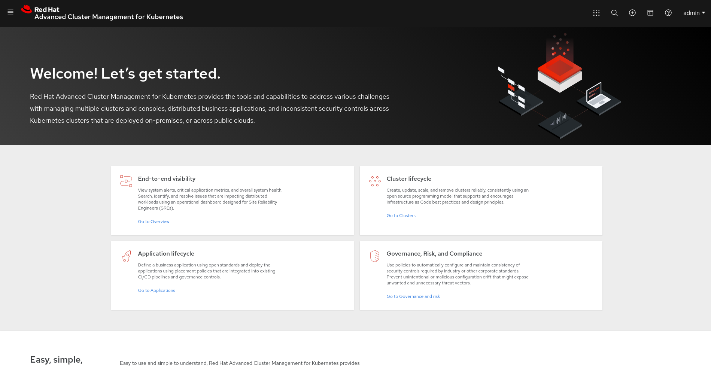

# RED HAT ADVANCED CLUSTER MANAGEMENT LABS

## RH ACM DEPLOYMENT

Reference: https://access.redhat.com/documentation/en-us/red_hat_advanced_cluster_management_for_kubernetes/2.0/html-single/install/index

Cluster: 
3 Masters - m5.xlarge
3 Workers - m5.xlarge


1. Create the RH ACM namespace:

```shell
oc create namespace rh-acm
```

2. Swith to the project

```shell
oc project rh-acm
```

3. Use the yaml below to create an operator group:

```yaml
apiVersion: operators.coreos.com/v1
kind: OperatorGroup
metadata:
  name: rhacm-og
spec:
  targetNamespaces:
  - rh-acm
```

4. Create the operator group:

```shell
oc apply -f rhacm-og.yaml
```

5. Use the yaml below to create a subscription:

```yaml
apiVersion: operators.coreos.com/v1alpha1
kind: Subscription
metadata:
  name: acm-operator-subscription
spec:
  sourceNamespace: openshift-marketplace
  source: redhat-operators
  channel: release-2.0
  installPlanApproval: Automatic
  name: advanced-cluster-management
```

6. Apply the subscription:

```shell
oc apply -f rhacm-subs.yaml
```
7. Download your pull secret on https://cloud.redhat.com/openshift/install/pull-secret.

8. Create a pull secret in the namespace:

```shell
oc create secret generic rh-pullsecret -n rh-acm --from-file=.dockerconfigjson=/tmp/pull-secret.txt --type=kubernetes.io/dockerconfigjson
```

9. Now create the MultiClusterHub using the yaml below:

```yaml
apiVersion: operator.open-cluster-management.io/v1
kind: MultiClusterHub
metadata:
  name: multiclusterhub
  namespace: rh-acm
spec:
  imagePullSecret: rh-pullsecret
```

10. Create the MCB:

```shell
oc apply -f multiclusterhub
```

11. Wait up to 10 minutes until you have all pods Running and Ready:

```shell
watch oc get all
> oc get pods
NAME                                                              READY   STATUS    RESTARTS   AGE
application-chart-81b08-applicationui-5cdfb97cc7-4hdts            1/1     Running   0          6m39s
application-chart-81b08-applicationui-5cdfb97cc7-9dtc9            1/1     Running   0          9m1s
cert-manager-ba5cb-6499488d89-qvlww                               1/1     Running   0          24m
cert-manager-ba5cb-6499488d89-zdvxg                               1/1     Running   0          25m
cert-manager-webhook-93dbc-cainjector-7855856c6c-cncxb            1/1     Running   0          27m
cert-manager-webhook-93dbc-cainjector-7855856c6c-t2v76            1/1     Running   0          35m
cert-manager-webhook-b868bcff5-76qz8                              1/1     Running   0          9m1s
cert-manager-webhook-b868bcff5-cwvwc                              1/1     Running   0          27m
cluster-manager-b48498fd5-6cdgv                                   1/1     Running   0          24m
cluster-manager-b48498fd5-g6mkl                                   1/1     Running   0          24m
cluster-manager-b48498fd5-nvsvv                                   1/1     Running   0          24m
configmap-watcher-ad4ba-6b65c4c6f6-2c8dl                          1/1     Running   0          27m
configmap-watcher-ad4ba-6b65c4c6f6-8t7gt                          1/1     Running   0          9m1s
console-chart-1d55f-consoleapi-87b495b5c-bh6zn                    1/1     Running   0          34m
console-chart-1d55f-consoleapi-87b495b5c-rnz66                    1/1     Running   0          34m
console-chart-1d55f-consoleui-69f9885dbb-9xs4h                    1/1     Running   0          9m1s
console-chart-1d55f-consoleui-69f9885dbb-h6lf6                    1/1     Running   0          9m2s
console-header-9f64755c8-bztc5                                    1/1     Running   0          14m
console-header-9f64755c8-jvfpw                                    1/1     Running   0          34m
grc-a7517-grcui-6499d75c6d-b8nzx                                  1/1     Running   0          9m1s
grc-a7517-grcui-6499d75c6d-gdlhn                                  1/1     Running   0          9m1s
grc-a7517-grcuiapi-9b7fd8b7c-d7jkt                                1/1     Running   0          9m2s
grc-a7517-grcuiapi-9b7fd8b7c-kxk4d                                1/1     Running   0          34m
grc-a7517-policy-propagator-865884d469-kskvg                      1/1     Running   0          27m
grc-a7517-policy-propagator-865884d469-pwlw5                      1/1     Running   0          20m
hive-operator-55f55bdbcd-m4sxf                                    1/1     Running   0          24m
klusterlet-addon-controller-5b764c4645-7f5xq                      1/1     Running   0          25m
klusterlet-addon-controller-5b764c4645-wjzvn                      1/1     Running   0          9m1s
kui-web-terminal-b8bd599f5-rgfjp                                  1/1     Running   0          9m1s
managedcluster-import-controller-579564d45f-jm245                 1/1     Running   0          34m
managedcluster-import-controller-579564d45f-t2l5b                 1/1     Running   0          9m1s
management-ingress-10d12-779b48c87-48pbr                          2/2     Running   0          33m
management-ingress-10d12-779b48c87-j8h9g                          2/2     Running   0          9m1s
multicluster-operators-application-66cf666845-r79t6               4/4     Running   0          24m
multicluster-operators-hub-subscription-5587664bfd-rmscv          1/1     Running   0          24m
multicluster-operators-standalone-subscription-5b9c554c49-krdqg   1/1     Running   0          24m
multiclusterhub-operator-5475d87b7f-b6767                         1/1     Running   0          24m
multiclusterhub-repo-85984f9cc6-ktlrn                             1/1     Running   0          25m
ocm-controller-747f8dcb9f-2gk5z                                   1/1     Running   0          25m
ocm-controller-747f8dcb9f-bp7b5                                   1/1     Running   0          24m
ocm-proxyserver-c59bc6c68-468l9                                   1/1     Running   0          24m
ocm-proxyserver-c59bc6c68-872vf                                   1/1     Running   0          9m1s
ocm-webhook-5954f77b85-5wsdp                                      1/1     Running   0          24m
ocm-webhook-5954f77b85-j58kr                                      1/1     Running   0          25m
search-operator-5d8dcf4944-xz4rq                                  1/1     Running   0          24m
search-prod-6092c-redisgraph-844c5f7596-xpngc                     1/1     Running   0          33m
search-prod-6092c-search-aggregator-65ff9d6cc9-dfsf8              1/1     Running   0          33m
search-prod-6092c-search-api-6c8b5c8b5-khcj2                      1/1     Running   0          9m1s
search-prod-6092c-search-api-6c8b5c8b5-rvzp7                      1/1     Running   0          6m35s
search-prod-6092c-search-collector-6f5d448cbf-qvjsd               1/1     Running   0          9m1s
topology-fab53-topology-58f4845fc6-cb5sj                          1/1     Running   0          9m2s
topology-fab53-topology-58f4845fc6-rkcmt                          1/1     Running   0          9m1s
topology-fab53-topologyapi-5fd4bb5fd9-gkbn5                       1/1     Running   0          9m1s
topology-fab53-topologyapi-5fd4bb5fd9-rhbn7                       1/1     Running   0          9m1s
```

12. Get the RH ACM route and access it:

```shell
> oc get routes
NAME                 HOST/PORT                                      PATH   SERVICES             PORT    TERMINATION            WILDCARD
multicloud-console   multicloud-console.apps.acmhub.rhbr-labs.com          management-ingress   <all>   passthrough/Redirect   None
```



# IMPORTING A NEW CLUSTER TO RH ACM


```shell
> oc login -u admin https://api.cluster-93bc.93bc.sandbox1234.opentlc.com:6443
Logged into "https://api.cluster-93bc.93bc.sandbox1234.opentlc.com:6443" as "admin" using existing credentials.

You have access to 57 projects, the list has been suppressed. You can list all projects with 'oc projects'

Using project "default".
> [root@gfontana ~]# echo Ci0tLQphcGlWZXJzaW9uOiBhcGlleHRlbnNpb25zLms4cy5pby92MWJldGExCmtpbmQ6IEN1c3RvbVJlc291cmNlRGVmaW5pdGlvbgptZXRhZGF0YToKICBjcmVhdGlvblRpbWVzdGFtcDogbnVsbAogIG5hbWU6IGtsdXN0ZXJsZXRzLm9wZXJhdG9yLm9wZW4tY2x1c3Rlci1tYW5hZ2VtZW50LmlvCnNwZWM6CiAgZ3JvdXA6IG9wZXJhdG9yLm9wZW4tY2x1c3Rlci1tYW5hZ2VtZW50LmlvCiAgbmFtZXM6C ...ommited... MzZmU3MTY1MTNlYWRmNgogIHdvcmtJbWFnZVB1bGxTcGVjOiByZWdpc3RyeS5yZWRoYXQuaW8vcmhhY20yL3dvcmstcmhlbDhAc2hhMjU2OjdiOGVhOTI3YTExNDViYmRhNDdmNTQ5MTQ4MjdkNDk2MTc0ZjcyZDcwOGQ2N2E0OGQzMzQwYWEzZmY1YTY3N2EK | base64 --decode | kubectl apply -f -
customresourcedefinition.apiextensions.k8s.io/klusterlets.operator.open-cluster-management.io created
clusterrole.rbac.authorization.k8s.io/klusterlet unchanged
clusterrole.rbac.authorization.k8s.io/open-cluster-management:klusterlet-admin-aggregate-clusterrole unchanged
clusterrolebinding.rbac.authorization.k8s.io/klusterlet unchanged
namespace/open-cluster-management-agent created
secret/bootstrap-hub-kubeconfig created
secret/open-cluster-management-image-pull-credentials created
serviceaccount/klusterlet created
deployment.apps/klusterlet created
klusterlet.operator.open-cluster-management.io/klusterlet created

```

# INSTALLING OPENSHIFT PIPELINES

OpenShift pipelines is installed through an Operator. The step-by-step can be found here: https://github.com/openshift/pipelines-tutorial/blob/master/install-operator.md


