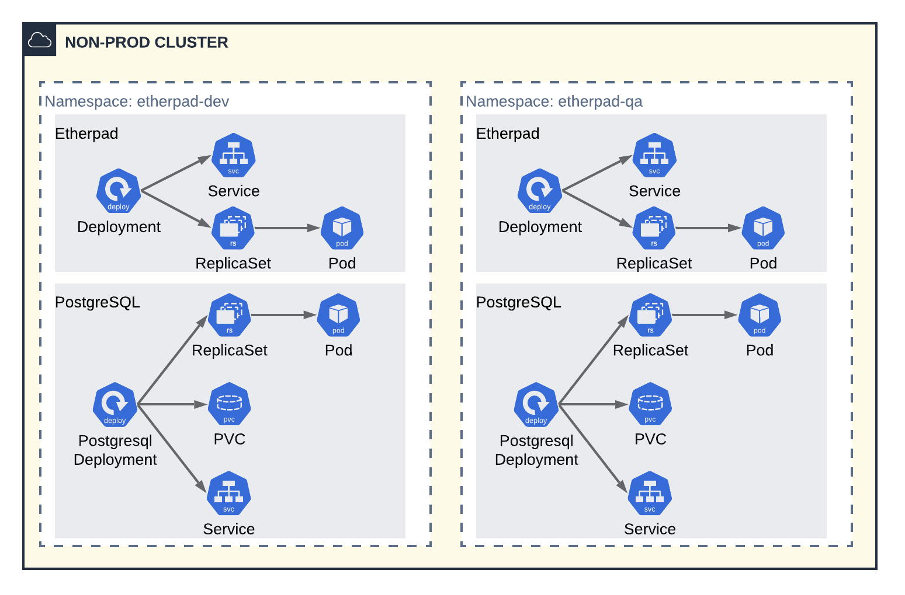
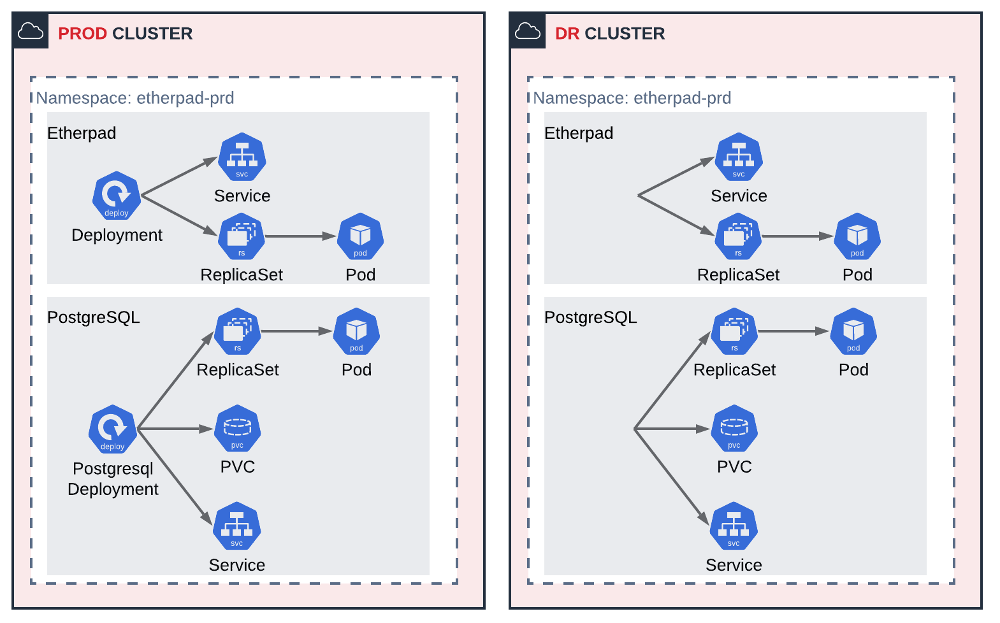
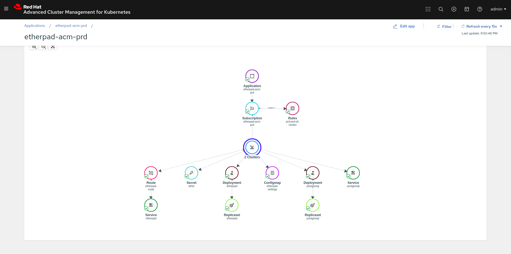

# GitOps Using Red Hat OpenShift Pipelines (Tekton) and Red Hat Advanced Cluster Management to Deploy on Multiple Clusters
### October 13th, 2020 | by Giovanni Fontana


Recently, Red Hat launched the Advanced Cluster Management tool, which aims to help organizations overcome the challenges of having applications deployed in multiple clusters and clouds. Red Hat is also actively collaborating with the Tekton project as the solution that will enable teams to build Kubernetes-style delivery pipelines that can fully control and own the complete life cycle of their microservices without having to rely on central teams to maintain and manage a CI server, plugins, and its configurations.

In the last article (see here) we saw how to use Tekton and Red Hat Advanced Cluster Management to deploy an application on multiple namespaces, one for each lifecycle environment (Dev, QA and Prod), using a **single** OpenShift managed cluster. In this article we are going to expand our use case to deploy that same application using **three different clusters**, one for **Non-Production** workloads, another for **Production** and a last one representing a **DR** (Disaster Recovery) cluster.

Therefore, our **Non-Production** cluster will have the Dev and QA projects:



On other hand, in our **Production** and **DR** clusters we are going to have exactly the same workload, which is the application production version - in this step we will see how to use the PlacementRule to deploy an application on multiple clusters at once!



In the last article we explored the different RH ACM object types: **Application, Channel, PlacementRule and Subscription**. We also deployed all **three stages on a single cluster**, therefore the PlacementRule is equal for all of them. At this time we will change them to be able to deploy the application on different clusters. Let’s check them:

**PlacementRule for Dev and QA:**

```yaml
---
apiVersion: apps.open-cluster-management.io/v1
kind: PlacementRule
metadata:
  name: nonprod-cluster
  namespace: etherpad-acm-dev
spec:
  clusterConditions:
    - type: ManagedClusterConditionAvailable
      status: "True"
  clusterSelector:
    matchLabels:
      environment: nonprod
```

**PlacementRule for Prod and DR:**
```yaml
---
apiVersion: apps.open-cluster-management.io/v1
kind: PlacementRule
metadata:
  name: prd-and-dr-cluster
  namespace: etherpad-acm-prd
spec:
  clusterConditions:
    - type: ManagedClusterConditionAvailable
      status: "True"
  clusterSelector:
    matchExpressions:
    - key: environment
      operator: In
      values:
      - prod
      - dr
```

NOTE: My clusters have been tagged with the following labels during their import to RH ACM:

* Non Production Cluster: environment=nonprod
* Production Cluster: environment=prod
* DR Cluster: environment=dr

Let’s run it? The yaml files are in this github repo: https://github.com/giofontana/rhacm-pipelines/tree/master/multipleclusters-multiple-envs


Note that when you create the subscription for prod environment, RH ACM starts the deployment of the etherpad application on two clusters at the same time (Prod and DR).



Therefore, we already addressed how to deploy an application on multiple namespaces in multiple clusters using RH ACM. Now we need to inject what we already have on a Tekton pipeline.

Our pipeline now will cover the following process:


1. **[TEKTON - TASK creating-namespaces]** Create the namespaces on the OpenShift Hub Cluster (where RH ACM is deployed);
2. **[TEKTON - TASK etherpad-dev-deployment]** Create Application, Channel, PlacementRule for NON-PRODUCTION and Subscription;
3. **[RH ACM - DEV DEPLOYMENT]** Deploy etherpad application on etherpad-dev namespace in NON-PRODUCTION cluster
4. **[TEKTON - TASK etherpad-qa-deployment]** Create Application, Channel, PlacementRule for NON-PRODUCTION and Subscription;
5. **[RH ACM - QA DEPLOYMENT]** Deploy etherpad application on etherpad-qa namespace in NON-PRODUCTION cluster
6. **[TEKTON - TASK etherpad-prd-deployment]** Create Application, Channel, PlacementRule for PRODUCTION + DR and Subscription;
7. **[RH ACM - PROD + DR DEPLOYMENT]** Deploy etherpad application on etherpad-prod namespace in PRODUCTION and DR cluster.

Here we can notice something that in my perspective is really valuable about using **RH ACM** as your deployment tool: You don’t need to change anything in your pipeline because now you need to deploy your application in more clusters - **you just need to change the PlacementRule object** of the environment you need to change. In the last article we deployed the Dev, QA and Prod application in a single cluster, we are now deploying this same application using three different clusters and what have we changed? Only the PlacementRule object! Very nice right?

To finish our article, let’s see our pipeline in action!


# Conclusion

In this article, we improved the application deployment to simulate a more real world scenario using RH ACM and Tekton: Deploy of Dev and QA version of an application in a NON-PRODUCTION cluster and deploy of the Production version in two different clusters (PROD and DR) at the same time. We also saw that, by using RH ACM, we “decouple” the deployment logic from the pipeline and we were able to change the deployment targets by only changing the PlacementRule objects and no changes were needed on the Tekton side.

What did you think? Interesting, right? If you are interested in knowing more about OpenShift Pipelines and Red Hat Advanced Cluster Management for Kubernetes talk to a Red Hatter by filling [this form](https://www.redhat.com/en/technologies/management/advanced-cluster-management#contact-form) or talking to your Red Hat representative. You can also see more about it on the [Red Hat Videos YouTube channel](https://www.youtube.com/watch?v=gKw-bJGYTQw).
