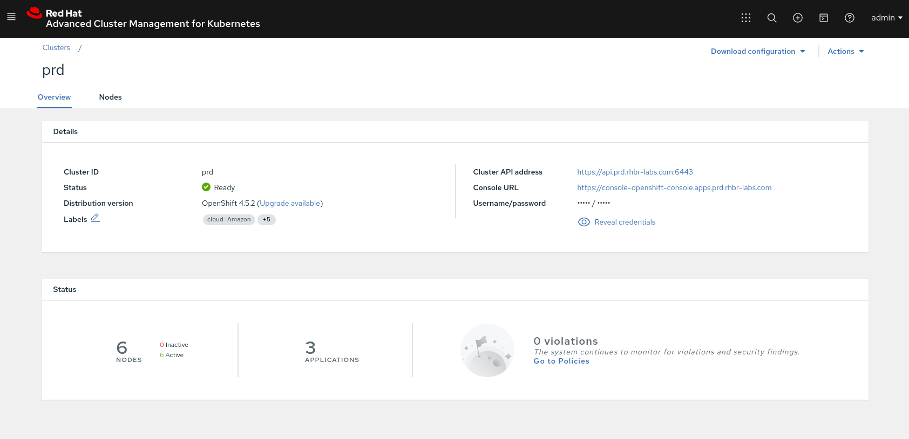
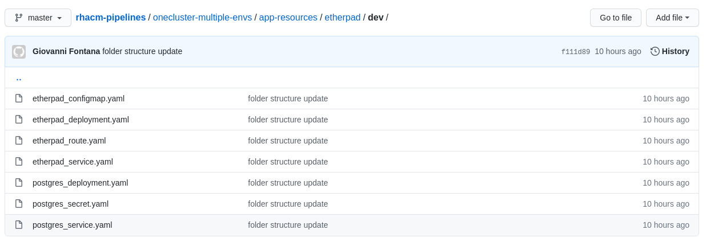
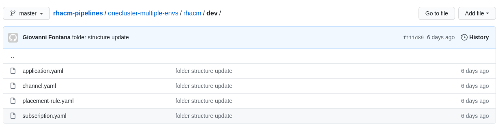
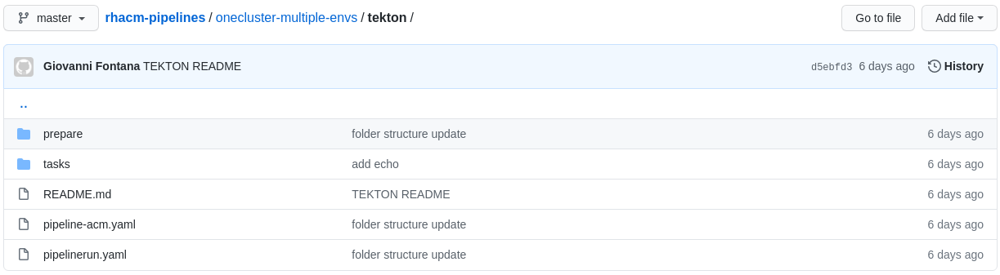
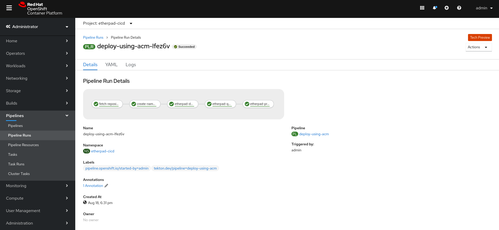

<center>

</center>

# GitOps using Red Hat OpenShift Pipelines (Tekton) and Red Hat Advanced Cluster Management
#### August 28th, 2020 | by Giovanni Fontana

Recently, Red Hat launched the Advanced Cluster Management tool, which aims to help organizations overcome the challenges of having applications deployed in multiple clusters and clouds. Red Hat is also actively collaborating with the Tekton project as the solution that will enable teams to build Kubernetes-style delivery pipelines that can fully control and own the complete lifecycle of their microservices without having to rely on central teams to maintain and manage a CI server, plugins, and its configurations.

In this article, we will use both worlds together to build a CI/CD pipeline which will deploy an application in multiple environments and multiple clusters. If this is the first time you see RH ACM, I recommend you start by reading [this article](https://www.openshift.com/blog/understanding-gitops-with-red-hat-advanced-cluster-management).

Use Cases:

In general, each organization defines its application lifecycle strategy differently based on its own business requirements. Having that in mind, I will try to reproduce some general use cases, from simpler ones to more complex use cases.

1. **One single cluster**: multiple environments using different namespaces.
2. **Two clusters**: one for non-production workloads and another one for production.
3. **Three or more clusters**: one for non-production workloads and two or more clusters for production workloads (e.g.: Production and DR cluster).

Also, we will simulate first a simpler scenario where we will focus only on the deployment of an image (essentially the CD stage) and finally a more complete pipeline including the building phase (entire CI/CD workflow).

In this article, I am going to show only the first use case. Use cases 2 and 3 will be covered in the next posts.

## Preparation:

I will not cover the installation of RH ACM and OpenShift Pipelines. The deployment is very straightforward using Operators and you can find the instructions in the official documentation:

* [Installing OpenShift Pipelines | Pipelines | OpenShift Container Platform 4.5](https://docs.openshift.com/container-platform/4.5/pipelines/installing-pipelines.html)
* [Install Red Hat Advanced Cluster Management for Kubernetes 2.0](https://access.redhat.com/documentation/en-us/red_hat_advanced_cluster_management_for_kubernetes/2.0/html/install/index)

Both tools have been installed in a dedicated OpenShift cluster, which RH ACM names as “hub cluster”. Also, the managed-cluster has been imported in RH ACM with name “prd”:



## GitOps in a single OpenShift cluster using Red Hat OpenShift Pipelines (Tekton) and Red Hat Advanced Cluster Management

In this use case, I will be using the etherpad, a sample application from [rhacm-labs](https://github.com/redhat-gpte-devopsautomation/rhacm-labs). 

### Resources:

Basically we have three types of resources we will need to handle:

1. **Application resources**: YAML files that describe the k8s application, such as the application deployment, route, services, and so on.



2. **RH ACM resources**: Files that will create the objects that RH ACM uses to manage an application. The following objects will be used:

* **Channels** (channel.apps.open-cluster-management.io): define the source repositories that a cluster can subscribe to with a subscription, and can be the following types: GitHub repositories, Helm release registries, object stores, and resource template (deployable) namespaces on the hub cluster. In our case, we are using a GitHub channel.
* **Subscriptions** (subscription.apps.open-cluster-management.io): allow clusters to subscribe to a source repository (channel). Subscriptions can be applied locally to the hub or to managed-clusters.
* **Placement rules** (placementrule.apps.open-cluster-management.io): define the target clusters where subscriptions deploy and maintain the Kubernetes resources. You can use placement rules to help you facilitate the multi-cluster deployment. Placement rules can be shared across subscriptions.
* **Applications** (application.app.k8s.io): Used in Red Hat Advanced Cluster Management for Kubernetes for grouping Kubernetes resources that make up an application.



3. **Tekton resources**: Files that will create the tasks and pipeline to deploy the application using RH ACM in three different stages: Development, QA, and Production.



All source code used in this demo is in this git repository: https://github.com/giofontana/rhacm-pipelines/tree/master/onecluster-multiple-envs

### Deploying an application using RH ACM

To begin our process let’s look first on how to deploy the sample application using RH ACM. The first thing we will need to do is to create namespaces on the hub cluster that will manage the application.

```yaml
---
apiVersion: v1
kind: Namespace
metadata:
  name: etherpad-acm-dev
---
apiVersion: v1
kind: Namespace
metadata:
  name: etherpad-acm-qa
---
apiVersion: v1
kind: Namespace
metadata:
  name: etherpad-acm-prd
```

We are creating a project for each stage of our application lifecycle (DEV/QA/PRD). This is a sample, in a real-world scenario probably you should use some annotations and labels in your namespaces also.

We also will have an application, channel, placement-rule, and subscription YAML file for each stage:

Example for **dev**:

```yaml
---
apiVersion: app.k8s.io/v1beta1
kind: Application
metadata:
  name: etherpad-acm-dev
  namespace: etherpad-acm-dev
spec:
  componentKinds:
  - group: apps.open-cluster-management.io
    kind: Subscription
  descriptor: {}
  selector:
    matchExpressions:
    - key: app
      operator: In
      values:
      - etherpad-acm-dev
---
apiVersion: apps.open-cluster-management.io/v1
kind: Channel
metadata:
  name: etherpad-app-latest
  namespace: etherpad-acm-dev
spec:
  type: GitHub
  pathname: https://github.com/giofontana/rhacm-pipelines.git 
---
apiVersion: apps.open-cluster-management.io/v1
kind: PlacementRule
metadata:
  name: dev-cluster
  namespace: etherpad-acm-dev
spec:
  clusterConditions:
    - type: ManagedClusterConditionAvailable
      status: "True"
  clusterSelector:
    matchLabels:
      environment: prd
---
apiVersion: apps.open-cluster-management.io/v1
kind: Subscription
metadata:
  name: etherpad-acm-dev
  namespace: etherpad-acm-dev
  labels:
    app: etherpad-acm-dev
  annotations:
    apps.open-cluster-management.io/github-path: onecluster-multiple-envs/app-resources/etherpad/dev
spec:
  channel: etherpad-acm-dev/etherpad-app-latest
  placement:
    placementRef:
      kind: PlacementRule
      name: dev-cluster
```

**Note**: You will notice that the clusterSelector for all stages are equal, this is because for while we are using one single managed-cluster. You can switch it according to as many clusters as you need.

This is the folder structure we will have in the end:

```console
onecluster-multiple-envs/rhacm
├── namespaces.yaml
├── dev
│   ├── application.yaml
│   ├── channel.yaml
│   ├── placement-rule.yaml
│   └── subscription.yaml
├── prd
│   ├── application.yaml
│   ├── channel.yaml
│   ├── placement-rule.yaml
│   └── subscription.yaml
└── qa
    ├── application.yaml
    ├── channel.yaml
    ├── placement-rule.yaml
    └── subscription.yaml
```

Now, let’s test it? To deploy this structure you just need to run each YAML file against the RH ACM hub cluster.


On the right side, you will see the managed cluster. Note that as soon as the subscription is created on the hub cluster, the deployment starts on the managed cluster - first DEV, then QA, and finally PRD.

### Creating a pipeline using RH ACM resources

Now that we already have our 3 projects for each stage (DEV/QA/PRD) being deployed and managed using RH ACM, we will create a pipeline to create the RH ACM resources automatically using Tekton.

To do that we have the following tasks in Tekton:

* create_namespaces: Create the namespaces needed in the hub cluster.
* etherpad-dev-deployment: Deployment of DEV stage of etherpad.
* etherpad-qa-deployment: Deployment of QA stage of etherpad.
* etherpad-prd-deployment: Deployment of PRD stage of etherpad.

Also, we created a pipeline with the following structure:

```yaml
apiVersion: tekton.dev/v1beta1
kind: Pipeline
metadata:
  name: deploy-using-acm
spec:
  workspaces:
  - name: shared-workspace
  params:
  - name: deployment-name
    type: string
    description: name of the deployment to be patched
  - name: git-url
    type: string
    description: url of the git repo for the code of deployment
    default: "https://github.com/giofontana/rhacm-pipelines.git"
  - name: git-revision
    type: string
    description: revision to be used from repo of the code for deployment
    default: "master"
  tasks:
  - name: fetch-repository
    taskRef:
      name: git-clone
      kind: ClusterTask
    workspaces:
    - name: output
      workspace: shared-workspace
    params:
    - name: url
      value: $(params.git-url)
    - name: subdirectory
      value: ""
    - name: deleteExisting
      value: "true"
    - name: revision
      value: $(params.git-revision)
      
  - name: create-namespaces
    taskRef:
      kind: Task        
      name: create-namespaces
    workspaces:
    - name: source
      workspace: shared-workspace
    runAfter:
    - fetch-repository     

  - name: etherpad-dev-deployment
    taskRef:
      kind: Task        
      name: etherpad-dev-deployment
    workspaces:
    - name: source
      workspace: shared-workspace
    runAfter:
    - create-namespaces      

  - name: etherpad-qa-deployment
    taskRef:
      kind: Task        
      name: etherpad-qa-deployment
    workspaces:
    - name: source
      workspace: shared-workspace
    runAfter:
    - etherpad-dev-deployment  

  - name: etherpad-prd-deployment
    taskRef:
      kind: Task        
      name: etherpad-prd-deployment
    workspaces:
    - name: source
      workspace: shared-workspace
    runAfter:
    - etherpad-qa-deployment   
```

We can now deploy the Tekton objects:

```console
> oc new-project etherpad-cicd

Now using project "etherpad-cicd" on server "https://api.acmhub.rhbr-labs.com:6443".

You can add applications to this project with the 'new-app' command. For example, try:

    oc new-app ruby~https://github.com/sclorg/ruby-ex.git

to build a new example application in Python. Or use kubectl to deploy a simple Kubernetes application:

    kubectl create deployment hello-node --image=gcr.io/hello-minikube-zero-install/hello-node

>  oc get serviceaccount pipeline
NAME       SECRETS   AGE
pipeline   2         29s

> cd onecluster-multiple-envs/tekton

> oc create -f tasks/01_create_namespaces.yaml
task.tekton.dev/create-namespaces created

> oc create -f tasks/02_create_dev_app_using_acm.yaml
task.tekton.dev/etherpad-dev-deployment created

> oc apply -f tasks/03_create_qa_app_using_acm.yaml
task.tekton.dev/etherpad-qa-deployment created

> oc apply -f tasks/04_create_prd_app_using_acm.yaml
task.tekton.dev/etherpad-prd-deployment created

> oc adm policy add-cluster-role-to-user cluster-admin system:serviceaccount:etherpad-cicd:pipeline
clusterrole.rbac.authorization.k8s.io/cluster-admin added: "system:serviceaccount:etherpad-cicd:pipeline"

> oc apply -f pipeline-acm.yaml
pipeline.tekton.dev/deploy-using-acm created

> oc apply -f prepare/tekton-source-pvc.yaml
persistentvolumeclaim/source-pvc created
```

And run our pipeline:

```console
> oc apply -f pipelinerun.yaml
pipelinerun.tekton.dev/deploy-using-acm-run-1 created

> tkn pipelinerun logs deploy-using-acm-run-1 -f
[fetch-repository : clone] + CHECKOUT_DIR=/workspace/output/
[fetch-repository : clone] + '[[' true '==' true ]]
[fetch-repository : clone] + cleandir
[fetch-repository : clone] + '[[' -d /workspace/output/ ]]
[fetch-repository : clone] + rm -rf /workspace/output//onecluster-multiple-envs
[fetch-repository : clone] + rm -rf /workspace/output//.git
[fetch-repository : clone] + rm -rf '/workspace/output//..?*'
[fetch-repository : clone] + test -z 
[fetch-repository : clone] + test -z 
[fetch-repository : clone] + test -z 
[fetch-repository : clone] + /ko-app/git-init -url https://github.com/giofontana/rhacm-pipelines.git -revision master -refspec  -path /workspace/output/ '-sslVerify=true' '-submodules=true' -depth 1
[fetch-repository : clone] {"level":"info","ts":1597794549.2025642,"caller":"git/git.go:136","msg":"Successfully cloned https://github.com/giofontana/rhacm-pipelines.git @ f111d89c17e5647d3cd4dedca6968f20b73cfb0d (grafted, HEAD, origin/master) in path /workspace/output/"}
[fetch-repository : clone] {"level":"info","ts":1597794549.240191,"caller":"git/git.go:177","msg":"Successfully initialized and updated submodules in path /workspace/output/"}
[fetch-repository : clone] + cd /workspace/output/
[fetch-repository : clone] + git rev-parse HEAD
[fetch-repository : clone] + tr -d '\n'
[fetch-repository : clone] + RESULT_SHA=f111d89c17e5647d3cd4dedca6968f20b73cfb0d
[fetch-repository : clone] + EXIT_CODE=0
[fetch-repository : clone] + '[' 0 '!=' 0 ]
[fetch-repository : clone] + echo -n f111d89c17e5647d3cd4dedca6968f20b73cfb0d

[create-namespaces : creating-namespaces] **** Creating namespaces ****
[create-namespaces : creating-namespaces] namespace/etherpad-acm-dev unchanged
[create-namespaces : creating-namespaces] namespace/etherpad-acm-qa unchanged
[create-namespaces : creating-namespaces] namespace/etherpad-acm-prd unchanged

[etherpad-dev-deployment : etherpad-dev-deployment] **** DEV ENVIRONMENT: Creating application on RH ACM ****
[etherpad-dev-deployment : etherpad-dev-deployment] application.app.k8s.io/etherpad-acm-dev unchanged
[etherpad-dev-deployment : etherpad-dev-deployment] **** DEV ENVIRONMENT: Creating channel on RH ACM ****
[etherpad-dev-deployment : etherpad-dev-deployment] channel.apps.open-cluster-management.io/etherpad-app-latest unchanged
[etherpad-dev-deployment : etherpad-dev-deployment] **** DEV ENVIRONMENT: Creating placementrule on RH ACM ****
[etherpad-dev-deployment : etherpad-dev-deployment] placementrule.apps.open-cluster-management.io/dev-cluster unchanged
[etherpad-dev-deployment : etherpad-dev-deployment] **** DEV ENVIRONMENT: Creating subscription on RH ACM ****
[etherpad-dev-deployment : etherpad-dev-deployment] subscription.apps.open-cluster-management.io/etherpad-acm-dev unchanged

[etherpad-qa-deployment : etherpad-qa-deployment] **** QA ENVIRONMENT: Creating application on RH ACM ****
[etherpad-qa-deployment : etherpad-qa-deployment] application.app.k8s.io/etherpad-acm-qa unchanged
[etherpad-qa-deployment : etherpad-qa-deployment] **** QA ENVIRONMENT: Creating channel on RH ACM ****
[etherpad-qa-deployment : etherpad-qa-deployment] channel.apps.open-cluster-management.io/etherpad-app-latest unchanged
[etherpad-qa-deployment : etherpad-qa-deployment] **** QA ENVIRONMENT: Creating placementrule on RH ACM ****
[etherpad-qa-deployment : etherpad-qa-deployment] placementrule.apps.open-cluster-management.io/qa-cluster unchanged
[etherpad-qa-deployment : etherpad-qa-deployment] **** QA ENVIRONMENT: Creating subscription on RH ACM ****
[etherpad-qa-deployment : etherpad-qa-deployment] subscription.apps.open-cluster-management.io/etherpad-acm-qa unchanged

[etherpad-prd-deployment : etherpad-qa-deployment] **** PRD ENVIRONMENT: Creating application on RH ACM ****
[etherpad-prd-deployment : etherpad-qa-deployment] application.app.k8s.io/etherpad-acm-prd unchanged
[etherpad-prd-deployment : etherpad-qa-deployment] **** PRD ENVIRONMENT: Creating channel on RH ACM ****
[etherpad-prd-deployment : etherpad-qa-deployment] channel.apps.open-cluster-management.io/etherpad-app-latest unchanged
[etherpad-prd-deployment : etherpad-qa-deployment] **** PRD ENVIRONMENT: Creating placementrule on RH ACM ****
[etherpad-prd-deployment : etherpad-qa-deployment] placementrule.apps.open-cluster-management.io/prd-cluster unchanged
[etherpad-prd-deployment : etherpad-qa-deployment] **** PRD ENVIRONMENT: Creating subscription on RH ACM ****
[etherpad-prd-deployment : etherpad-qa-deployment] subscription.apps.open-cluster-management.io/etherpad-acm-prd unchanged
```

Note that the tasks have “unchanged” results because we already have our application deployed.

Here is how we see this pipeline in the web console:



### Conclusion

In this article, we saw how to create three applications on RH ACM in your hub cluster to deploy a sample application for each stage of its lifecycle: Development, QA, and production. We also learned how to create a pipeline using Tekton to make those deployments automatically.

In the next article we are going to explore how to have a similar case, but deploying the application in more than one cluster (use cases 2 and 3). In a final article, I am planning to share an entire CI/CD pipeline, including the build phase that we are not mentioning yet.

I encourage you to try out Red Hat Advanced Cluster Management for Kubernetes if you are looking for a solution for multi-cluster, see [here](https://www.redhat.com/en/technologies/management/advanced-cluster-management) how to try it. Combining it with Red Hat OpenShift Pipelines (Tekton) will give you a powerful native Kubernetes solution for GitOps, you can find more information about it in the [OpenShift documentation page](https://docs.openshift.com/container-platform/4.5/pipelines/understanding-openshift-pipelines.html).
